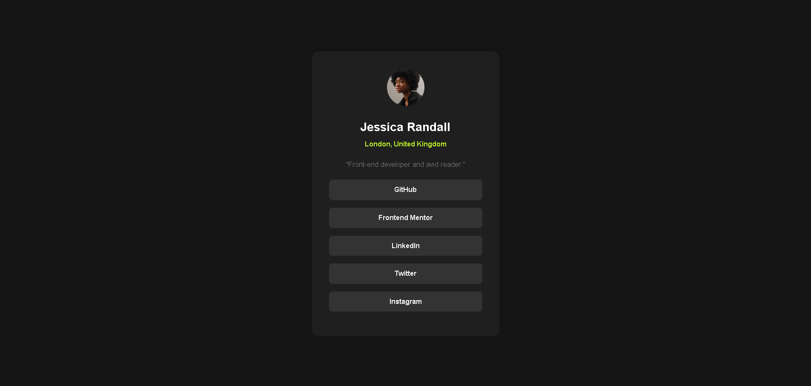

# Frontend Mentor - Social links profile solution

This is a solution to the [Social links profile challenge on Frontend Mentor](https://www.frontendmentor.io/challenges/social-links-profile-UG32l9m6dQ). Frontend Mentor challenges help you improve your coding skills by building realistic projects.

## Table of contents

- [Overview](#overview)
  - [The challenge](#the-challenge)
  - [Screenshot](#screenshot)
  - [Links](#links)
- [My process](#my-process)
  - [Built with](#built-with)
  - [What I learned](#what-i-learned)
  - [Continued development](#continued-development)
  - [AI Collaboration](#ai-collaboration)
- [Author](#author)

## Overview

### The challenge

Users should be able to:

- See hover and focus states for all interactive elements on the page

### Screenshot



### Links

- Solution URL: [GitHub Repository](https://github.com/dawudasasfeh/Social-links-profile)
- Live Site URL: [Live Site](https://social-links-profile-smoky-ten.vercel.app/)

## My process

### Built with

- Semantic HTML5 markup
- CSS custom properties
- Flexbox
- Mobile-first workflow

### What I learned

This is the first web page I have built from a design challenge. I learned how to approach a project in a structured way: first analyze the design, then break it into visual blocks, then write the HTML structure, and finally apply CSS styles step by step.

I also learned how desktop media queries work, why they are useful, and how to use them to refine spacing and sizing for larger screens.

```css
@media (min-width: 768px) {
  body {
    font-size: 14px;
  }

  .main {
    padding: 24px;
  }

  .profile-card {
    max-width: 440px;
    padding: 40px;
  }

  #profile-photo {
    width: 88px;
    height: 88px;
  }

  #name {
    font-size: 28px;
    margin-bottom: 4px;
  }

  #location {
    font-size: 16px;
    margin-top: 0px;
  }

  #bio {
    font-size: 17px;
    margin-top: 22px;
    margin-bottom: 22px;
  }

  .link-card {
    margin: 18px 0;
    padding: 11px 0;
    font-size: 16px;
  }
}
```

### Continued development

My next step is learning React and continuing to build small projects to gain more hands-on experience, just like I did with this challenge.

### AI Collaboration

I used GitHub Copilot to help me plan my implementation and follow better practices while building. At the end, I compared my result against the target design and used Copilot to review what still needed improvement.

## Author

- Website - [Dawud Alasasfeh](#)
- Frontend Mentor - [@dawudasasfeh](https://www.frontendmentor.io/profile/dawudasasfeh)
